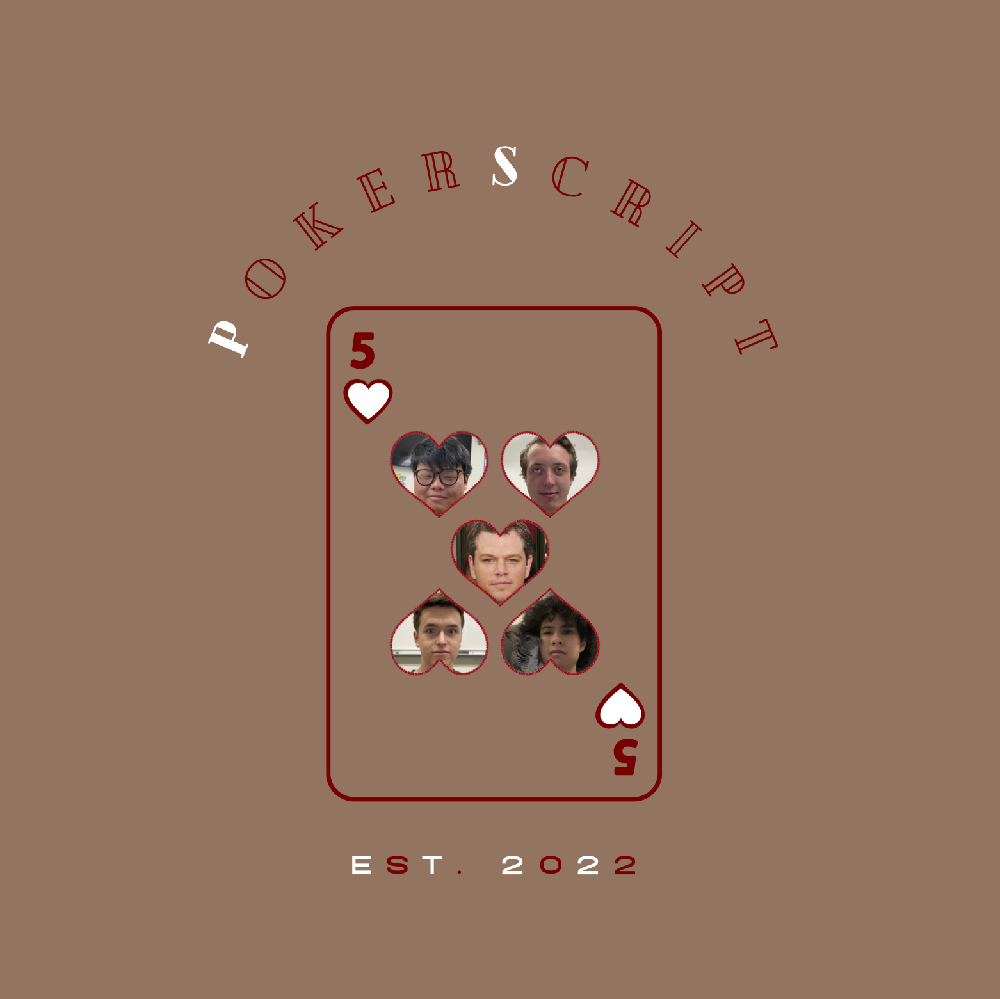

# PokerScript

Compiler for the language PokerScript

## Welcome to PokerScript

To the non-player, poker seems to be a game of chance. After all, it revolves around a shuffled deck of cards. Doesn't the hand that's dealt
decide one's fate?

We, the creators of PokerScript, know this not to be true. Poker is a game of skill. Our language celebrates the unique
lingo that surrounds the game of poker, including both official and informal terms. `break` = `fold`. `function` = `straddle`. And so much more. We can't wait to see what you build with PokerScript, because the hand you're dealt doesn't determine the game you play.

PokerScript is brought to you by [Evan Sciancalepore](https://github.com/evanscianc "Evan's Github"),
[Naradahana Utoro Dewo](https://github.com/naratheman "Nara's Github"), [Marvin Pramana](https://github.com/mpramana "Marvin's Github"), [Garrett Marzo](https://github.com/gmarzo "Garrett's Github") and [Warren Binder](https://github.com/wbinder1 "Warren's Github").

## Features

- Static typing
- Recursion
- Tuples
- List Comprehension
- `.ps` file extension

## Types

| JavaScript | PokerScript.     |
| ---------- | ---------------- |
| string     | stringbet        |
| number     | chip             |
| const      | constantpressure |
| bool       | playingontilt    |

## Built In Functions

| JavaScript                      | PokerScript                                |
| ------------------------------- | ------------------------------------------ |
| console.log(“Place your bets”); | reveal “Place your bets” “place your bets” |

## Variable Declaration and Assignment

| JavaScript                               | PokerScript                                       |
| ---------------------------------------- | ------------------------------------------------- |
| let x = 5;                               | chip x: 5                                         |
| let y = “hello!”;                        | stringbet y: “hello!”                             |
| let z = 100.52;                          | stringbets z: 100.52                              |
| let t = true;                            | playingontilt t: hit                              |
| let f = false;                           | playingontilt f: miss                             |
| const name = “I should be winning more”; | constantpressure name: “I should be winning more” |

## Arithmetic

- sum = 9 + 10
- difference = 9 - 10
- multiplication = 9 \* 10
- integer division = 9 / 10
- float division = 9 // 10
- exponents (9^10) = bigspender(9, 10)
- modulus = 9 % 10

## Keywords

| PokerScript      | Traditional |
| ---------------- | ----------- |
| fold             | break       |
| miss             | false       |
| hit              | true        |
| gamebreak        | break       |
| straddle         | function    |
| excuses          | if          |
| followingexcuses | else if     |
| nomoreexcuses    | else        |
| change           | switch      |
| ifdealt          | case        |
| blind            | default     |
| broke            | void        |
| bet              | for         |
| dealer           | async       |
| reveal           | print       |
| cashout          | return      |
| deal             | var         |

## Control Flow

### If Statements

<table>
<tr> <th>JavaScript</th><th>PokerScript</th><tr>
</tr>

<td>

```javascript
if x = 0{
  return true;
  else if{
  return false;
  }
}
```

</td>

<td>

```
excuses x == 0 $
  redeal hit
 followingexcuses $
  redeal miss
  $
$
```

</td>
</table>

### While, Do-While loops

<table>
<tr> <th>JavaScript</th><th>PokerScript</th><tr>
</tr>

<td>

```javascript
do {
  print("what is taking so long!?")
} while (condition)
```

</td>

<td>

```
action $
  reveal("What is taking so long!?")
$
contemplating(condition)
```

</td>
</table>

### For Loops

### For-Loops

- For loops in PokerScript must have two or three statements within them

<table>
<tr> <th>JavaScript</th><th>PokerScript</th><tr>
</tr>

<td>

```javascript
for (int x = 0; x < 10; x++) {
  for (int y = 0; y < 20; y++) {
    y += 5;
  }
}
```

</td>

<td>

```
playingloose(chip x = 0, x lower 10, x increment) {
  playingloose (chip y = 0, y lower 20, y increment) {
    y incrementby 5
  }
}
```

</td>
</table>

## Comments

In Poker, it's rude to comment on the way people play. Hence,
Single line comments are marked with `rude` and multiline comments are marked with `rude/` at the beginning and `/rude` at the end.

```

rude this is a single line comment

rude/
this is a multiline comment
/rude

```

## More Example Programs

### **JavaScript** on the left; **PokerScript** on the right.

Function Declaration
@JavaScript @PokerScript

```

function add (a, b) { straddle add (a, b) $
return a + b; cashout a + b
} $

```

```

```
