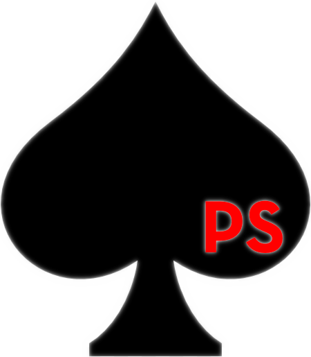

# PokerScript



### [PokerScript Home Page](https://naratheman.github.io/WebsitePokerScript/# "PokerScript Home Page")

## Welcome to PokerScript

To the non-player, poker seems to be a game of chance. After all, it revolves around a shuffled deck of cards. Doesn't the hand that's dealt
decide one's fate?

We, the creators of PokerScript, know this not to be true. Poker is a game of skill. Our language celebrates the unique
lingo that surrounds the game of poker, including both official and informal terms. `break` = `fold`. `function` = `straddle`. And so much more. We can't wait to see what you build with PokerScript, because the hand you're dealt doesn't determine the game you play.

PokerScript is brought to you by [Evan Sciancalepore](https://github.com/evanscianc "Evan's Github"),
[Naradahana Utoro Dewo](https://github.com/naratheman "Nara's Github"), [Marvin Pramana](https://github.com/mpramana "Marvin's Github"), [Garrett Marzo](https://github.com/gmarzo "Garrett's Github") and [Warren Binder](https://github.com/wbinder1 "Warren's Github").

## The Team


## Features

- Static typing
- Recursion
- Tuples
- `.ps` file extension

## Types

| Types   | PokerScript.  |
| ------- | ------------- |
| string  | stringBet     |
| integer | chip          |
| float   | change        |
| bool    | playingOnTilt |

In poker, a "string bet" is when a player doesn't make their bet in a continuous motion and also doesn't declare the amount of their bet.

A chip represents a dollar amount in poker. Chips can be as high as $100,000 in high stakes games.

Change refers to dollar amounts less than $1 (e.g., 50¢ worth of change). Poker players typically don't concern themselves with such small amounts, but hey, you never know.

Tilt is a poker term for a state of mental or emotional confusion or frustration in which a player adopts a less than optimal strategy, usually resulting in the player becoming overly aggressive. Trust us, you don't want to play on tilt.

## Built In Functions

### Printing
| JavaScript                      | PokerScript              |
| ------------------------------- | ------------------------ |
| console.log(“Place your bets”); | reveal “Place your bets” |

## Variable Declaration and Assignment

| JavaScript                               | PokerScript                                                 |
| ---------------------------------------- | ----------------------------------------------------------- |
| let x = 5;                               | chip x: 5                                                   |
| let y = “hello!”;                        | stringBet y: “hello!”                                       |
| let z = 100.52;                          | change z: 100.52                                            |
| let t = true;                            | playingOnTilt t: hit                                        |
| let f = false;                           | playingOnTilt f: miss                                       |
| const name = “I should be winning more”; | constantPressure stringBet name: "I should be winning more" |

## Arithmetic

- Sum: `9 + 10`
- Difference: `9 - 10`
- Multiplication: `9 \* 10`
- Integer Division: `9 / 10`
- Float Division: `9 // 10`
- Exponents (e.g. 9^10): `bigspender(9, 10)`
- Modulus: `9 % 10`

## Keywords

| PokerScript      | Traditional |
| ---------------- | ----------- |
| fold             | break       |
| miss             | false       |
| hit              | true        |
| straddle         | function    |
| excuses          | if          |
| followingExcuses | else if     |
| noMoreExcuses    | else        |
| sleight          | switch      |
| ifdealt          | case        |
| blind            | default     |
| broke            | void        |
| playingLoose     | for         |
| dealer           | async       |
| reveal           | print       |
| cashout          | return      |
| deal             | var         |

## Control Flow

### If Statements

<table>
<tr> <th>JavaScript</th><th>PokerScript</th><tr>
</tr>

<td>

```javascript
if (x == 0) {
  return true;
  
} else {
  return false;
}
```

</td>
<td>

```
excuses x == 0 $.
  cashout hit
  
.$ noMoreExcuses $.
  cashout miss
.$
```

</td>
</table>

### While, Do-While loops

<table>
<tr> <th>JavaScript</th><th>PokerScript</th><tr>
</tr>

<td>

```javascript
let patience = 3;
while (patience != 0) {
  console.log("What is taking so long!?");
  patience--;
}
```

</td>

<td>

```
chip patience: 3
contemplating patience != 0  $.
  reveal "What is taking so long!?"
  patience -$
.$
```

</td>
</table>

### For-Loops

- For loops in PokerScript must have two or three statements within them.

<table>
<tr> <th>JavaScript</th><th>PokerScript</th><tr>
</tr>

<td>

```javascript
let winnings = 0
for (int x = 0; x < 10; x++) {
  for (int y = 0; y < 20; y++) {
    winnings += 5;
  }
}
```

</td>

<td>

```
chip winnings: 0
playingLoose (chip x: 0, x < 10, x+$) $.
  playingLoose (chip y: 0, y < 20, y+$) $.
    winnings +$ 5
  .$
.$
```

</td>
</table>

## Comments

In Poker, it's rude to comment on the way people play. Hence,
Single line comments are marked with `rude` and multiline comments are marked with `rude/` at the beginning and `/rude` at the end.

```

rude this is a single line comment

rude/
this is a multiline comment
/rude

```

## More Example Programs

### **JavaScript** on the left; **PokerScript** on the right.

<table>
<tr> <th>JavaScript</th><th>PokerScript</th><tr>
</tr>

<td>

```javascript
function add(a, b) {
  return a + b
}
```

</td>

<td>

```
straddle add(a, b) $.
  cashout a + b
.$
```

</td>
</table>

<table>
<tr> <th>JavaScript</th><th>PokerScript</th><tr>
</tr>

<td>

```javascript
let arr = [2, 4, 6]
```

</td>

<td>

```
flop chip arr: [2, 4, 6]
```

</td>
</table>
